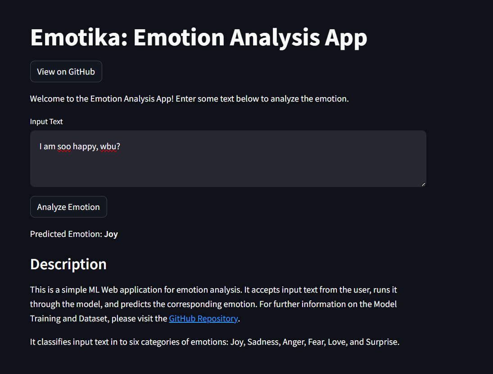

# Emotika

Emotika is NLP Project for emotion analysis. It analyzes the emotion in the input text using ML model and displays the predicted emotion to the user.



## Features

- **Emotion Analysis**: Enter text into the input box, and Emotica will analyze the emotion in the text and display the predicted emotion.

## Demo

You can try out Emotika by visiting [https://emotika.streamlit.app/](https://emotika.streamlit.app/).

## Installation

To run Emotica locally, follow these steps:

1. Clone the repository and Install dependencies:

   ```bash
   git clone https://github.com/abdulmunimjemal/emotika.git
   cd emotika
   pip install -r requirements.txt
   ```
2. Run the streamlit app
   
   ```bash
   streamlit run main.py
   ```
3. Access Emotica in your browser at http://localhost:8501

## Contributing
Contributions are welcome! If you would like to contribute to Emotika, please fork the repository, make your changes, and submit a pull request.


## Acknowledgments
Special thanks to Streamlit for providing an excellent framework for building web applications with Python.
